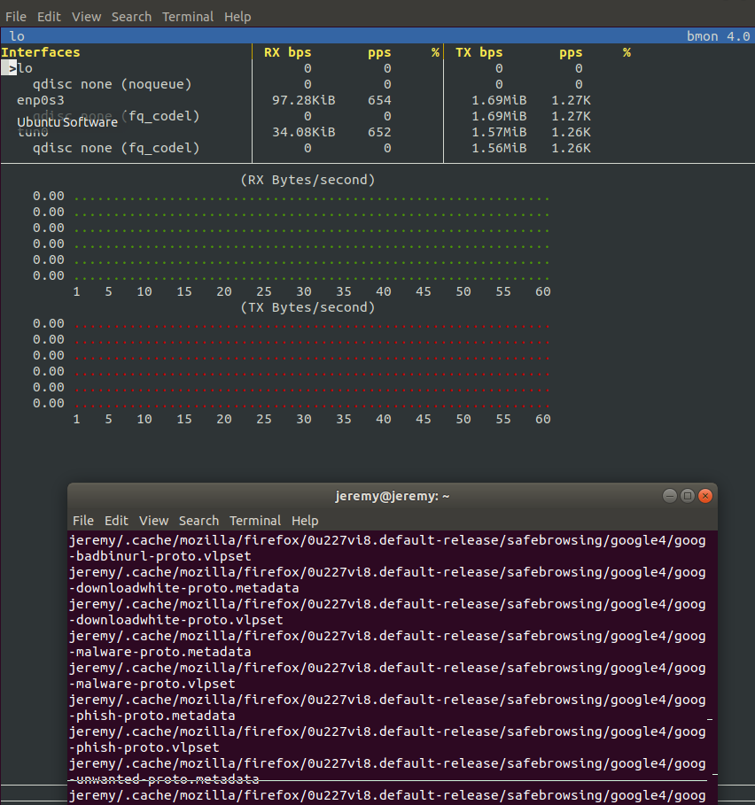
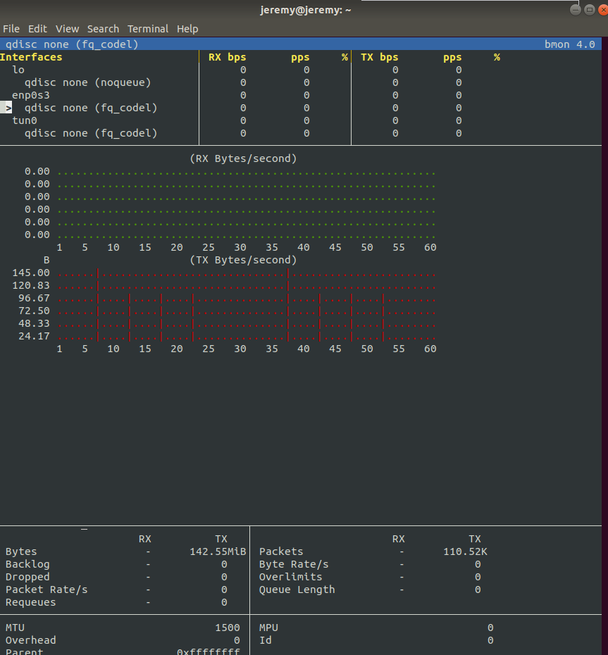

# AIT - Labo 02 - File system snapshots

Jeremy Zerbib - Adrien Barth

## Task 1 : Local Sync

1. We can verify the size of the home directory with the `du` command:

   ```bash
   $ du -sh /home/adrien/
   151M    /home/adrien/
   ```

   The command used to create a full uncompressed backup is  :

   ```bash
    $ sudo tar cd home_adrien.tar /home/adrien/
   ```

2. In order to create the backup directory, we used the following command : 

   ```bash
   $ sudo mkdir /adrien_backup
   ```

   Also, we changed the rights using this command : 

   ```bash
   $ sudo chown adrien:adrien /adrien_backup
   ```

3. From the `/adrien_backup` directory, we perform a `rsync` backup: 

   ```bash
   $ rsync -av /home/adrien/ $(date -u +%Y-%m-%d-%H%M%S)
   sending incremental file list
   created directory 2019-10-14-122317
   ./
   .bash_history
   .bash_logout
   .bashrc
   .profile
   .sudo_as_admin_successful
   random_file_1
   random_file_2
   .cache/
   .cache/motd.legal-displayed
   .gnupg/
   .gnupg/private-keys-v1.d/
   
   sent 157,330,429 bytes  received 227 bytes  104,887,104.00 bytes/sec
   total size is 157,291,282  speedup is 1.00
   ```

   - **What do these options do?**

     Those options ensure that : 

     - `-v` : The console output is verbose. It explains all the operations the command is doing
     - `-a` : Perform the backup in *archive mode*, it will make sure that permissions and attributes will be copied.

   - **Specifically, which options are implied by the `-a` option and what do they do?**

     All options are implied with `-a` with the exception of *hard links* being preserved. As this kind of operation is expensive, you want to ensure the `-H` option is specified to preserved those links.

   - **How can you use the `date` command to avoid typing the timestamp of the current time? How do you make `date` produce UTC time?**
     Using the `date` command, you can produce the UTC time using the `-u` option. 

     ```bash
     $ date -u +%Y-%m-%d-%H%M%S
     2019-10-14-122641
     ```
     
   - **How much disk space is used by the backup directory?**

     Using the `du -sh 2019-10-14-122317/` command, we find out the total space is 151MB large.

4. The command used is : 

   ```bash
   $ rsync -av /home/adrien/ $(date -u +%Y-%m-%d-%H%M%S) --delete --link-dest=../2019-10-14-122317
   sending incremental file list
   created directory 2019-10-14-123046
   
   sent 407 bytes  received 55 bytes  924.00 bytes/sec
   total size is 157,291,282  speedup is 340,457.32
   
   ```

   - `--delete` : Deletes files in the destination directory if they don't exist in the source directory.

   - `--link-dest=DIR` : hard link to files in *DIR* when unchanged.

   - **How much disk space is used by the backup directory according to the `du` command? **

     151MB are used according to the `du` command :

     ```bash
     $ du -sh /adrien_backup/
     151M    /adrien_backup/
     ```

   - **How much by the individual snapshot directories? **

     Using the `du` command, we observe that the new backup's size is only 16K:

     ```bash
     $ du -sh /adrien_backup/*
     151M    /adrien_backup/2019-10-14-122317
     16K     /adrien_backup/2019-10-14-123046
     ```

   - **How do you explain what `du` displays (if you had to write the `du` command, how would you count hard links)?** 

     Using the `--link-dest` argument with `rsync` will create hard links to the original backup. It explains why the new folder's size is small, it only count the size of the links themselves.
     
     For example we can see that the file `random_file_1` points to the same `inode` :
     
     ```bash
     $ ls -lisa  2019-10-14-122317/random_file_1
     524299 102400 -rw-rw-r-- 2 adrien adrien 104857600 Oct 14 11:53 2019-10-14-122317/random_file_1
     $ ls -lisa  2019-10-14-123046/random_file_1
     524299 102400 -rw-rw-r-- 2 adrien adrien 104857600 Oct 14 11:53 2019-10-14-123046/random_file_1
     ```
     
     The `inode` is `524299` with both files.

5. We randomize the file `/home/adrien/random_file_1` with the following command to ensure it's different from the original one:

   ```bash
   $ head -c 100M </dev/urandom >/home/adrien/random_file_1
   ```

   After performing a new backup, we can see in the output that only the file `random_file_1` has been backuped again:

   ```bash
   $ rsync -av /home/adrien/ $(date -u +%Y-%m-%d-%H%M%S) --delete --link-dest=../2019-10-14-122317
   sending incremental file list
   created directory 2019-10-14-131508
   random_file_1
   
   sent 104,883,646 bytes  received 79 bytes  69,922,483.33 bytes/sec
   total size is 157,291,282  speedup is 1.50
   ```

   Using the `stat` command, we can see that the `inode` of our recently modified file has changed:

   ```bash
   $ stat -c '%i' 2019-10-14-122317/random_file_1
   524299
   $ stat -c '%i' 2019-10-14-131508/random_file_1
   524311
   ```

   As we modified only the 100M file, we can see that the new backup has a size of 101M (new file + links):

   ````bash
   $ du -sh /adrien_backup/
   251M    /adrien_backup/
   $ du -sh /adrien_backup/*
   151M    /adrien_backup/2019-10-14-122317
   16K     /adrien_backup/2019-10-14-123046
   101M    /adrien_backup/2019-10-14-131508
   ````

6. We can delete the original full backup using the `rm` command:

   ```bash
   $ rm -rf 2019-10-14-122317/
   ```

   Incremental backup use hard links to the file on disk, deleting the original full backup won't cause any troubles because it will only delete hard links, not the file themselves.

   We can verify that files are still reachable in the incremental backups by calculating, for example, the `md5` sum:

   ```bash
   $ md5sum /home/adrien/random_file_2
   f2e0720ed2bc9980e2d4af7f37afb32a  /home/adrien/random_file_2
   $ md5sum /adrien_backup/2019-10-14-123046/random_file_2
   f2e0720ed2bc9980e2d4af7f37afb32a  /adrien_backup/2019-10-14-123046/random_file_2
   ```

   The `md5` sums are the same, so deleting the original full backup won't impact the incremental backups !


## Task 2 : Set up SSH for remote login

1. **In your personal `.ssh` directory download the `key.sec` file below this document. Be sure to remove all permissions for `group` and `others` from this file.**

   All permissions were removed using the `chmod` command.

2. **Test logging into your account on the remote machine using SSH. Log out again.**

   ```bash
   ssh ait.lan.iict.ch -l jeremy_zerbib -i .ssh/key.sec
   ```

   In order to log out, we used `exit` in the terminal.

3. **On your local machine configure an SSH shortcut to the account on the remote machine. Create the file `~/.ssh/config` if does not yet exist and add the following lines to it:**

   ```bash
   # Cloud virtual machine for AIT lab
   Host cloudvm
       Hostname ait.lan.iict.ch
       IdentityFile ~/.ssh/key.sec
       User jeremy_zerbib
   ```

   In order to do this part, we copied the config above using : 

   ```bash
   gedit .ssh/config
   ```

   **Replace the username after `User` by your account name.**

   **Test this shortcut by typing `ssh cloudvm`. You should see the command line prompt of the remote machine.**

   ```bash
   ssh cloudvm 
   Welcome to Ubuntu 16.04.6 LTS (GNU/Linux 4.4.0-165-generic x86_64)
   
    * Documentation:  https://help.ubuntu.com
    * Management:     https://landscape.canonical.com
    * Support:        https://ubuntu.com/advantage
   
   5 packages can be updated.
   0 updates are security updates.
   
   New release '18.04.2 LTS' available.
   Run 'do-release-upgrade' to upgrade to it.
   
   
   Last login: Sun Oct 13 15:50:07 2019 from 10.192.18.127
   ```
## Task 3 : Remote Sync

1. **Create a backup directory on the remote machine as described in Task 1 so that your user can read/write.**

   After login into the *ssh* session, we created a folder

   ```bash
   mkdir /jeremy_backup
   ```

2. **Repeat the full backup and the incremental backup of task 1, but with the backup going to the remote machine over SSH. In the `rsync` command you need to prefix the destination parameter with `cloudvm:` to tell `rsync` to use SSH to transfer the data to the remote machine.**

   ```bash
   rsync -av /home/ cloudvm:jeremy_backup/2017-09-25-093533 --delete --link-dest=2017-09-25-093533/
   ```

3. **Optional: Using a network monitoring tool on your local Linux machine like `bmon` observe how much network traffic `rsync` is causing.**

   The bandwith used by *ssh* is monitored by `bmon`. 

   

   



