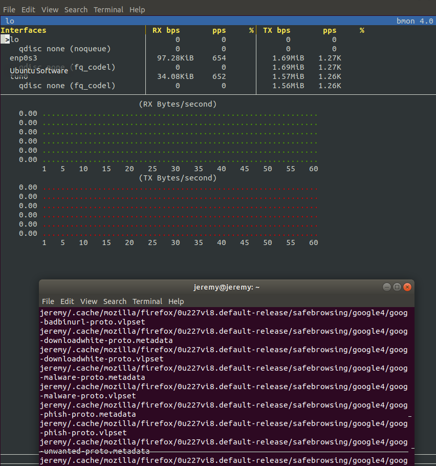
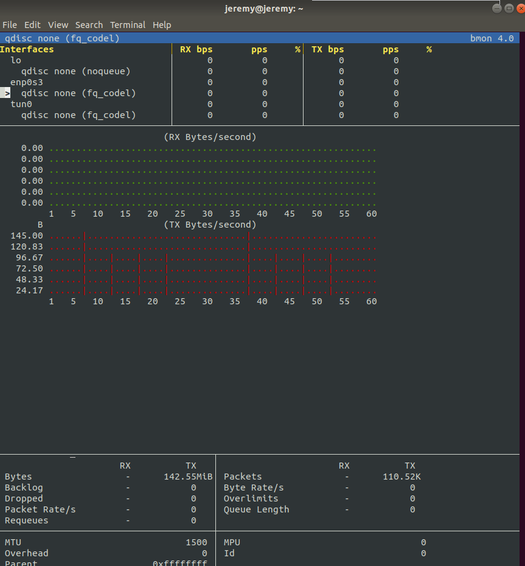

# LAB 01 - LINUX BACKUP

## Jeremy Zerbib - Adrien Barth

## Task 1 : Local Sync

1. The output of 

   ```bash
   du -sh /home 
   210M	/home
   ```

   The command used to create a full uncompressed backup is  :

   ```bash
    sudo tar cf /mnt/backup2/uncompressed.tar /home/
   ```

2. In order to create the backup directory, we used the following command : 

   ```bash
   sudo mkdir /mnt/backup2/jeremy_backup
   ```

   Also, we changed the rights using this command : 

   ```bash
   sudo chown jeremy /mnt/backup2/jeremy_backup/
   ```

3. After typing the command : 

   ```bash
   rsync -av /home/ 2017-09-25-093533
   ```

   - **What do these options do?**

     Those options ensure that : 

     - `-v` : The console output is verbose. It explains all the operations the command is doing
     - `-a` : Turns in the *archive mode*.

   - **Specifically, which options are implied by the `-a` option and what do they do?**

     All options are implied with `-a` with the exception of *hard links* being preserved. As this kind of operation is expensive, you want to ensure the `-H` option is specified to preserved those links.

   - **How can you use the `date` command to avoid typing the timestamp of the current time? How do you make `date` produce UTC time?**
     Using the `date` command, you can produce the UTC time using the `-u` option. 

   - **How much disk space is used by the backup directory?**

     Using the `du -sh 2017-09-25-093533/` command, we find out the total space is 44MB large.

4. The command used is : 

   ```bash
   rsync -av /home/ 2017-09-25-093533 --delete --link-dest=2017-09-25-093533/
   ```

   - `--delete` : Deletes files in the destination directory if they don't exist in the source directory.

   - `--link-dest=DIR` : hard link to files in *DIR* when unchanged.

   - **How much disk space is used by the backup directory according to the `du` command? **

     44MB are used according to the `du` command.

   - **How much by the individual snapshot directories? **

     According to the individual snapshot directory, 946.4 kB are used.

   - **How do you explain what `du` displays (if you had to write the `du` command, how would you count hard links)?** 

     We could explain that `du` reads the links and therefore, it reads the size of those links. 

5. In the `jeremy` folder, we created a file called `a` using this : 

   ```bash
   touch a
   ```

   We ran the `stat` command on a screenshot done some time prior to the backup

   ```bash
   stat /home/jeremy/Pictures/Screenshot\ from\ 2019-09-25\ 22-01-01.png 
     File: /home/jeremy/Pictures/Screenshot from 2019-09-25 22-01-01.png
     Size: 445774    	Blocks: 872        IO Block: 4096   regular file
   Device: 801h/2049d	Inode: 131311      Links: 1
   Access: (0664/-rw-rw-r--)  Uid: ( 1000/  jeremy)   Gid: ( 1000/  jeremy)
   Access: 2019-10-13 13:36:16.777078803 +0200
   Modify: 2019-09-25 22:01:01.653816263 +0200
   Change: 2019-09-25 22:01:01.653816263 +0200
    Birth: -
   ```

   Then we ran it on the file created : 

   ```bash
   stat /home/jeremy/a 
     File: /home/jeremy/a
     Size: 0         	Blocks: 0          IO Block: 4096   regular empty file
   Device: 801h/2049d	Inode: 131490      Links: 1
   Access: (0644/-rw-r--r--)  Uid: ( 1000/  jeremy)   Gid: ( 1000/  jeremy)
   Access: 2019-10-13 15:26:39.567370013 +0200
   Modify: 2019-10-13 15:26:39.567370013 +0200
   Change: 2019-10-13 15:26:39.567370013 +0200
    Birth: -
   ```

   Then we rerun the command used before.

   The `stat` command shows us for the screenshot : 

   ```bash
   stat /home/jeremy/Pictures/Screenshot\ from\ 2019-09-25\ 22-01-01.png 
     File: /home/jeremy/Pictures/Screenshot from 2019-09-25 22-01-01.png
     Size: 445774    	Blocks: 872        IO Block: 4096   regular file
   Device: 801h/2049d	Inode: 131311      Links: 1
   Access: (0664/-rw-rw-r--)  Uid: ( 1000/  jeremy)   Gid: ( 1000/  jeremy)
   Access: 2019-10-13 13:36:16.777078803 +0200
   Modify: 2019-09-25 22:01:01.653816263 +0200
   Change: 2019-09-25 22:01:01.653816263 +0200
    Birth: -
   ```

   And for the file : 

   ```bash
   stat /home/jeremy/a 
     File: /home/jeremy/a
     Size: 0         	Blocks: 0          IO Block: 4096   regular empty file
   Device: 801h/2049d	Inode: 131490      Links: 1
   Access: (0644/-rw-r--r--)  Uid: ( 1000/  jeremy)   Gid: ( 1000/  jeremy)
   Access: 2019-10-13 15:30:22.943370013 +0200
   Modify: 2019-10-13 15:26:39.567370013 +0200
   Change: 2019-10-13 15:26:39.567370013 +0200
    Birth: -
   ```

   We can see that the date accessed on the new file has changed, as for the old file, access has not changed.

6. **What happens to the files in the incremental backup that were hardlinked to the files of the full backup?**

   

   ## Task 2 : Set up SSH for remote login

   1. **In your personal `.ssh` directory download the `key.sec` file below this document. Be sure to remove all permissions for `group` and `others` from this file.**

      All permissions were removed using the `chmod` command.

   2. **Test logging into your account on the remote machine using SSH. Log out again.**

      ```bash
      ssh ait.lan.iict.ch -l jeremy_zerbib -i .ssh/key.sec
      ```

      In order to log out, we used `exit` in the terminal.

   3. **On your local machine configure an SSH shortcut to the account on the remote machine. Create the file `~/.ssh/config` if does not yet exist and add the following lines to it:**

      ```
      # Cloud virtual machine for AIT lab
      Host cloudvm
          Hostname ait.lan.iict.ch
          IdentityFile ~/.ssh/key.sec
          User jeremy_zerbib
      ```

      In order to do this part, we copied the config above using : 

      ```bash
      gedit .ssh/config
      ```

      **Replace the username after `User` by your account name.**

      **Test this shortcut by typing `ssh cloudvm`. You should see the command line prompt of the remote machine.**

      ```
      ssh cloudvm 
      Welcome to Ubuntu 16.04.6 LTS (GNU/Linux 4.4.0-165-generic x86_64)
      
       * Documentation:  https://help.ubuntu.com
       * Management:     https://landscape.canonical.com
       * Support:        https://ubuntu.com/advantage
      
      5 packages can be updated.
      0 updates are security updates.
      
      New release '18.04.2 LTS' available.
      Run 'do-release-upgrade' to upgrade to it.
      
      
      Last login: Sun Oct 13 15:50:07 2019 from 10.192.18.127
      ```

      ## Task 3 : Remote Sync


1. **Create a backup directory on the remote machine as described in Task 1 so that your user can read/write.**

   After login into the *ssh* session, we created a folder

   ```bash
   mkdir /jeremy_backup
   ```

2. **Repeat the full backup and the incremental backup of task 1, but with the backup going to the remote machine over SSH. In the `rsync` command you need to prefix the destination parameter with `cloudvm:` to tell `rsync` to use SSH to transfer the data to the remote machine.**

   ```bash
   rsync -av /home/ cloudvm:jeremy_backup/2017-09-25-093533 --delete --link-dest=2017-09-25-093533/
   ```

3. **Optional: Using a network monitoring tool on your local Linux machine like `bmon` observe how much network traffic `rsync` is causing.**

   The bandwith used by *ssh* is monitored by `bmon`. 

   

   



